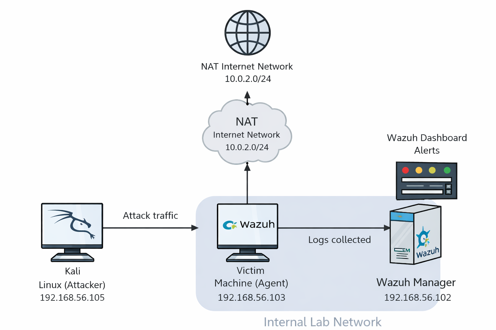
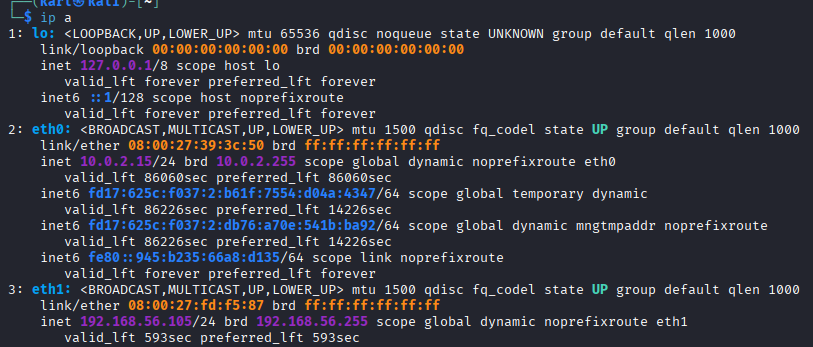
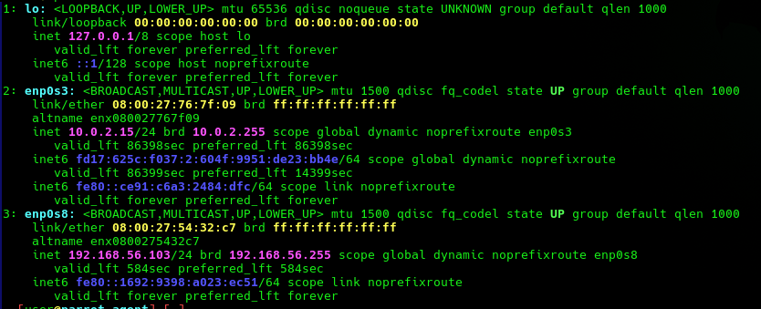
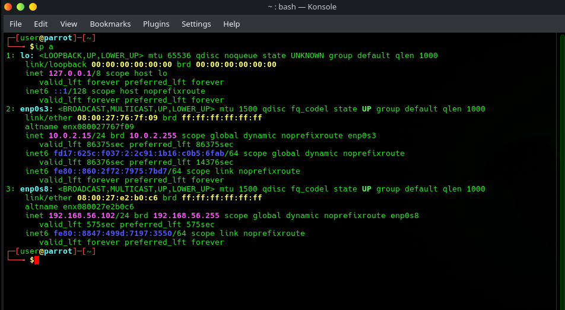
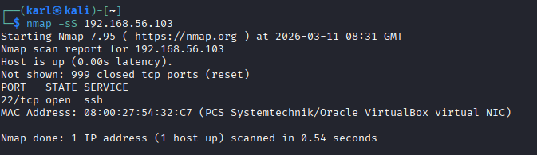
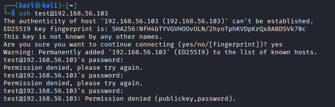
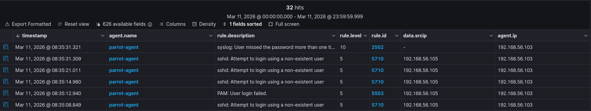
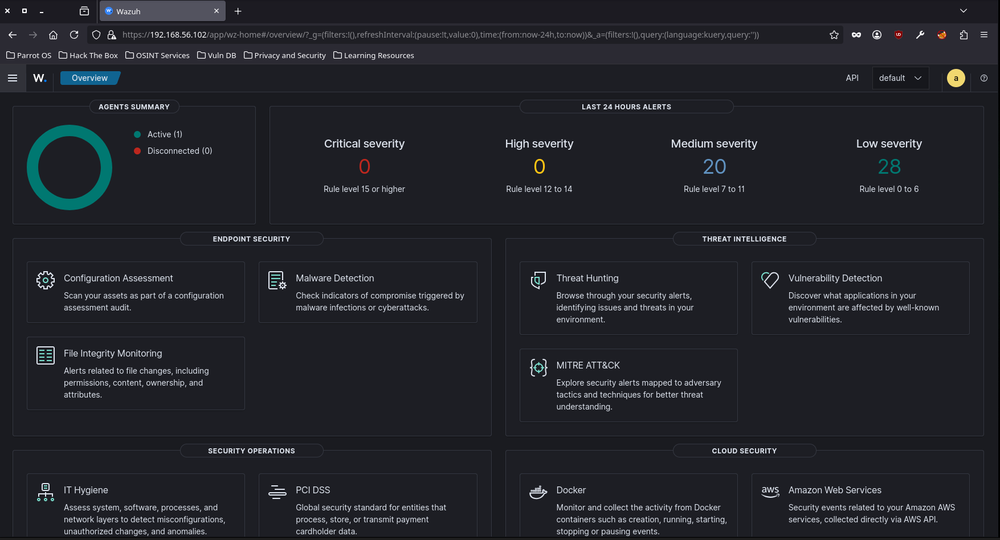

This project demonstrates a cybersecurity homelab designed to simulate real-world attacks and detect them using Wazuh SIEM.

The environment includes a Kali Linux attack machine, a monitored victim machine running a Wazuh agent, and a Wazuh manager used for security monitoring and alert detection.

# Wazuh SIEM Homelab
## Lab Architecture

Machines used in the lab:

- Kali Linux (Attacker) – 192.168.56.105
- Victim Machine with Wazuh Agent – 192.168.56.103
- Wazuh Manager (SIEM) – 192.168.56.102

- ## Network Setup

- ### Kali Linux Attacker

### Victim Machine (Wazuh Agent)

### Wazuh Manager

## Attack Simulation
From the Kali attacker machine, an Nmap scan was performed against the victim host.
nmap -sS 192.168.56.103

Multiple failed SSH login attempts were performed to simulate a credential attack.
ssh test@192.168.56.103

## Detection in Wazuh
The Wazuh SIEM successfully detected authentication failures generated by the attack machine.

## Security Dashboard
The Wazuh dashboard aggregates alerts and displays security events based on severity levels.

## Skills Demonstrated
SIEM deployment
Security monitoring
Attack simulation
Threat detection
Log analysis
Network security investigation

## Tools Used
Wazuh SIEM
Kali Linux
Parrot OS
Nmap
SSH
VirtualBox
Linux networking
